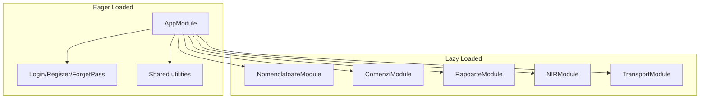

# Zoiss App - Improvement Analysis Plan

## 1. Security

### 1.1 XSS vulnerabilities (High priority)

**Unsafe `innerHTML` without sanitization:**


| File                                                                                                                                          | Issue                                             |
| --------------------------------------------------------------------------------------------------------------------------------------------- | ------------------------------------------------- |
| [notificari-list.component.html](c:\Projects\Zoiss app\zoiss-app\src\app\notificari\notificari-list\notificari-list.component.html) (line 17) | `[innerHtml]="item.descriere"` - no sanitization  |
| [notificari-item.component.html](c:\Projects\Zoiss app\zoiss-app\src\app\notificari\notificari-item\notificari-item.component.html) (line 7)  | `[innerHtml]="notif.descriere"` - no sanitization |


If `descriere` comes from user input or the API without server-side sanitization, an attacker could inject malicious scripts.

**Fix:** Apply the existing `SafeHtmlPipe` (or `DomSanitizer.sanitize(SecurityContext.HTML, value)`) to both. Example: `[innerHtml]="item.descriere | safeHtml"`.

### 1.2 Token storage (Medium - documented)

[SecurityService](c:\Projects\Zoiss app\zoiss-app\src\app\security\security.service.ts) stores JWT in `localStorage`, which is vulnerable to XSS theft. The code already documents this. Improvement: migrate to HttpOnly cookies (requires backend support).

### 1.3 Routes without authentication guards (Medium)


| Route                                | Risk                                      |
| ------------------------------------ | ----------------------------------------- |
| `notes` (StickyNotesListComponent)   | No `canActivate` - unauthenticated access |
| `notificari` / `notificari/edit/:id` | No `canActivate` - unauthenticated access |


**Fix:** Add `canActivate: [isAuthenticatedGuard]` to these routes in [app-routing.module.ts](c:\Projects\Zoiss app\zoiss-app\src\app\app-routing.module.ts).

### 1.4 Content Security Policy (CSP)

[index.html](c:\Projects\Zoiss app\zoiss-app\src\index.html) has a TODO for CSP. Configure CSP via server headers in production to reduce XSS impact.

### 1.5 Icons service - path traversal risk (Low)

[icons.service.ts](c:\Projects\Zoiss app\zoiss-app\src\app\utilities\icons.service.ts) uses `bypassSecurityTrustResourceUrl` with user-provided `name`. Validate that `name` contains only safe characters (alphanumeric, hyphen) and no path traversal (`..`, `/`).

---

## 2. Bundle size and initial load speed

### 2.1 No lazy loading (Critical)

All 40+ route components are eager-loaded via [app.module.ts](c:\Projects\Zoiss app\zoiss-app\src\app\app.module.ts). The entire app (Highcharts, ZXing, Angular Editor, etc.) loads on first visit.

**Impact:** Large initial bundle, slow first contentful paint (FCP).

**Fix:** Convert to lazy-loaded feature modules. Example structure:




Routes should use `loadChildren`:

```typescript
{ path: 'produse', loadChildren: () => import('./nomenclatoare/produse/produse.module').then(m => m.ProduseModule) }
```

### 2.2 Unused dependencies


| Package              | Status                                                                                                                                         |
| -------------------- | ---------------------------------------------------------------------------------------------------------------------------------------------- |
| `@auth0/angular-jwt` | In package.json, **never imported** - remove                                                                                                   |
| `jquery`             | Loaded in angular.json scripts, **not used in TS/HTML** - remove if Bootstrap can work without it (Bootstrap 5 has minimal jQuery requirement) |


### 2.3 Heavy libraries


| Library                        | Note                                                                                                                         |
| ------------------------------ | ---------------------------------------------------------------------------------------------------------------------------- |
| **moment.js**                  | Large (~300KB). Consider `date-fns` or native `Intl` for smaller bundle                                                      |
| **Highcharts**                 | Full lib + exporting + export-data loaded in Dashboard and reports. Lazy load report modules so charts only load when needed |
| **@material-design-icons/svg** | Entire package copied to assets. Consider only copying icons actually used                                                   |
| **Bootstrap**                  | Full CSS. If only using grid/utilities, consider switching to Tailwind or importing only required Bootstrap modules          |


### 2.4 Global scripts

[angular.json](c:\Projects\Zoiss app\zoiss-app\angular.json) loads jQuery and Bootstrap JS globally. Verify whether any component actually needs Bootstrap JS (e.g. dropdowns, modals). If usage is minimal, consider replacing with Angular Material equivalents.

### 2.5 Bundle budgets

Current: `maximumWarning: 4mb`, `maximumError: 4mb`. This is very permissive. After lazy loading, aim for initial bundle under 1MB and set stricter budgets.

---

## 3. Runtime performance and memory

### 3.1 UnsubscribeService memory leak (Critical)

[UnsubscribeService](c:\Projects\Zoiss app\zoiss-app\src\app\unsubscribe.service.ts) is `providedIn: 'root'`. Its `ngOnDestroy()` runs only when the **application** is destroyed, not when components are destroyed. Components using `takeUntil(this.unsubscribeService.unsubscribeSignal$)` never have their subscriptions cleaned up when navigating away.

**Affected:** ComenziListComponent, DashboardComponent, ComisionArhitectiComponent, and ~15 other components.

**Fix options:**

1. **Per-component Subject:** Each component defines `private destroy$ = new Subject<void>()`, uses `takeUntil(this.destroy$)`, and completes it in `ngOnDestroy`.
2. **Angular 16+ DestroyRef:** Use `inject(DestroyRef)` and `destroyRef.onDestroy(() => destroy$.next())` for a cleaner pattern.
3. **Async pipe:** Prefer `async` pipe in templates over manual `subscribe` where possible.

### 3.2 Change detection strategy

Only [authorize-view.component.ts](c:\Projects\Zoiss app\zoiss-app\src\app\security\authorize-view\authorize-view.component.ts) uses `ChangeDetectionStrategy.OnPush`. List components (ComenziListComponent, ProduseListComponent, etc.) could benefit from OnPush for fewer change detection cycles, especially when combined with immutable data patterns.

### 3.3 Track expressions in @for

Many `@for` loops use `track item` or `track prod` (object reference). When arrays are reassigned with new object instances, Angular may re-render more than necessary. Prefer `track item.id` or `track prod.id` when stable IDs exist.

### 3.4 Console.log in production

`console.log` appears in ~45+ files (e.g. [icons.service.ts](c:\Projects\Zoiss app\zoiss-app\src\app\utilities\icons.service.ts) line 21). Remove or guard with `environment.production` before production builds.

---

## 4. Code quality and maintainability

### 4.1 Deprecated APIs

- **RxJS `toPromise()`:** Used in [security.service.ts](c:\Projects\Zoiss app\zoiss-app\src\app\security\security.service.ts) (line 63). Replace with `firstValueFrom(obs)` or `lastValueFrom(obs)`.

### 4.2 TypeScript configuration

- `strictNullChecks: false` in [tsconfig.json](c:\Projects\Zoiss app\zoiss-app\tsconfig.json) - enables null/undefined bugs. Consider enabling incrementally.

### 4.3 Unused guard

`IsAdminGuard` exists but is commented out in routes. Either implement role-based route protection for admin-only features or remove the guard.

### 4.4 Router configuration

[app-routing.module.ts](c:\Projects\Zoiss app\zoiss-app\src\app\app-routing.module.ts) uses `RouterModule.forRoot(routes)` without options. Consider:

- `scrollPositionRestoration: 'enabled'` for better UX when navigating back
- `preloadingStrategy: PreloadAllModules` (after lazy loading) for faster subsequent navigation

---

## 5. Other recommendations

### 5.1 Font loading

[index.html](c:\Projects\Zoiss app\zoiss-app\src\index.html) loads both:

- `Roboto` from Google Fonts
- `Material Icons` from Google Fonts

Angular Material typically includes Roboto. Avoid duplicate font loads; use `font-display: swap` if not already set.

### 5.2 JWT interceptor edge case

[jwt-interceptor.service.ts](c:\Projects\Zoiss app\zoiss-app\src\app\security\jwt-interceptor.service.ts): In the 401 handler, `token` is captured from before the request. If refresh succeeds, the retried request uses `getToken()` (the new one) - this is correct. However, consider handling concurrent 401s (e.g. multiple tabs) to avoid multiple refresh attempts - a simple in-flight refresh lock would help.

### 5.3 ZXing packages

Both `@zxing/browser` and `@zxing/library` are used by `@zxing/ngx-scanner`. The ngx-scanner package manages this; no immediate action unless upgrading causes issues.

---

## Priority summary


| Priority | Category    | Items                                      |
| -------- | ----------- | ------------------------------------------ |
| **P0**   | Security    | XSS in notificari innerHTML                |
| **P0**   | Performance | UnsubscribeService memory leak             |
| **P0**   | Bundle      | Implement lazy loading                     |
| **P1**   | Security    | Add guards to notes/notificari routes      |
| **P1**   | Bundle      | Remove @auth0/angular-jwt, evaluate jQuery |
| **P1**   | Quality     | Replace toPromise, remove console.logs     |
| **P2**   | Security    | CSP, token storage migration               |
| **P2**   | Performance | OnPush, track by id                        |
| **P2**   | Bundle      | Optimize moment, Highcharts, fonts         |


---

## Questions for clarification

1. **Backend control:** Do you have control over the API at `api.zoiss.ro`? HttpOnly cookie migration and CSP require server-side changes.
2. **Bootstrap usage:** Are Bootstrap JS components (dropdowns, modals, carousel) used anywhere, or could they be replaced with Angular Material?
3. **Target browsers:** Are you supporting older browsers? This affects polyfill and `zone.js` optimization choices.
4. **Priority focus:** Would you prefer to tackle security first, or bundle size/performance first?

